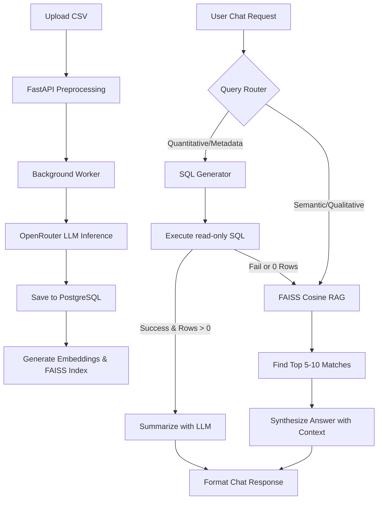

# Feedback Pulse ⚡ - Customer Feedback BI Portal

An end-to-end, production-grade Business Intelligence portal that processes raw customer feedback CSV files, uses LLMs to perform sentiment analysis and categorization, and exposes an advanced interactive analytics dashboard along with a **Hybrid AI Data Agent Chatbot** powered by SQL Generation and semantic **Retrieval-Augmented Generation (RAG)**.

---

## 🏗️ Architecture & Technical Workflow



### 1. The Batch ingestion & Analysis Pipeline
- **CSV Preprocessing & Validation**: Clean and validate incoming feedback messages. Standardize dates, drop invalid/duplicate records, filter out short or meaningless rows, and ensure correct data types.
- **Asynchronous LLM Processing**: To prevent UI timeouts, an upload creates a `batch_id` and starts a background thread. For each feedback text, it uses an online LLM (`meta-llama/llama-3.1-8b-instruct`) to extract:
  - `sentiment`: Positive, Negative, or Neutral.
  - `category`: Billing, App Bug, Delivery, Staff/Support, or Other.
  - `summary`: A concise one-line summary of the core customer complaint.
- **Relational Storage**: Processes are stored as runs in the `batches` table and results in `analyzed_feedback` linking back to the `batch_id`.

---

## 🧠 Semantic Search (RAG) & Vector Database

When standard SQL filters cannot answer a qualitative question (e.g., *"are people complaining about late deliveries?"* or *"why are users unhappy with support?"*), the chatbot dynamically routes to **semantic vector search**.

### Step-by-Step RAG Mechanics

1. **Fingerprint Creation (Embeddings)**:
   - When a batch finishes processing (reaches `completed` status), the backend triggers vector index construction.
   - It extracts the `feedback_text` of all rows in the batch.
   - Using the **Sentence Transformers** library (running the lightweight and highly efficient `all-MiniLM-L6-v2` model), it converts each feedback text into a 384-dimensional dense vector representing the semantic meaning.
2. **FAISS Indexing & Cosine Similarity**:
   - The vectors are normalized using $L_2$ normalization (`faiss.normalize_L2`).
   - A FAISS **Flat Inner Product (IP)** index (`faiss.IndexFlatIP`) is constructed. Inner product on $L_2$-normalized vectors mathematically yields the **Cosine Similarity**.
   - The index is written to disk as `vector_indices/{batch_id}.index`, and the ordered list of records is saved as `vector_indices/{batch_id}.json`.
3. **Intent Classification & Fallback Routing**:
   - When the user asks a question, the backend classifies the intent:
     - **SQL**: Aggregations, counts, metadata filters (e.g. *"Show negative delivery complaints last 7 days"*).
     - **RAG**: Open-ended questions, semantic queries (e.g. *"What do people think of the billing system?"*).
   - **Double Fallback**: If the query is routed as SQL, but SQL execution fails or returns **0 rows**, the system automatically falls back to the RAG pathway to avoid failing or returning an empty result.
4. **Context Synthesis**:
   - The query is embedded and normalized.
   - FAISS searches the index to retrieve the top 5–8 most similar feedback messages.
   - These actual customer reviews are pasted into the prompt as context.
   - The LLM synthesizes a response strictly grounded in this context, returning it along with the matching records to the frontend for charting and listing.

---

## 🛠️ Project Structure

- `App.py`: The main FastAPI server defining REST endpoints, background task workers, query routing, FAISS indexing, and retrieval.
- `CreateDb.py`: Database initialization script creating the PostgreSQL tables `batches` and `analyzed_feedback` with foreign key relationships.
- `Connectdb.py`: Shared database credentials and psycopg2 connection logic.
- `OnlineLLM.py`: OpenRouter LLM client configuration (`meta-llama/llama-3.1-8b-instruct`).
- `Preprocessing.py`: Independent data validation and cleaning script.
- `SaveToDb.py`: Sync script to save offline CSV analytics results to PostgreSQL.
- `Main.py`: CLI-based feedback analysis execution tool.
- `vector_indices/`: Directory where the computed binary FAISS indices and JSON mappings are serialized.
- `FrontEnd/`: React + Vite frontend workspace.
  - `src/App.jsx`: Main frontend layout and state router.
  - `src/Pages/BatchDetailsPage.jsx`: Renders the Analytics Overview, Data Table Explorer, and the AI Data Agent Chat.

---

## 🚀 Setup & Execution

### Prerequisites
- Python 3.11+
- Node.js & npm
- PostgreSQL running locally with database `bi3`

### 1. Database Setup
Ensure PostgreSQL is running, then configure your credentials in [Connectdb.py](file:///e:/Bi3/Connectdb.py):
```python
conn = psycopg2.connect(
    host="localhost",
    database="bi3",
    user="your_username",
    password="your_password",
    port="5432"
)
```
Initialize the database tables:
```powershell
.\venv\Scripts\python.exe CreateDb.py
```

### 2. Backend Installation & Run
Install packages:
```powershell
.\venv\Scripts\pip.exe install -r requirements.txt
# (Ensuring sentence-transformers and faiss-cpu are installed)
.\venv\Scripts\pip.exe install sentence-transformers faiss-cpu
```
Start the FastAPI server:
```powershell
uvicorn App:app --reload
```
The documentation will be available at [http://localhost:8000/docs](http://localhost:8000/docs).

### 3. Frontend Installation & Run
Navigate to the frontend directory:
```powershell
cd FrontEnd
npm install
npm run dev
```
Open [http://localhost:5173](http://localhost:5173) in your browser.

---

## 🔬 Testing Chatbot Pathways

Open the AI Data Agent chat on the Batch Details page and test:

1. **SQL Aggregation Pathway**:
   - *Query*: `Show negative delivery complaints last 7 days`
   - *Result*: The chatbot classifies this as a database lookup. It generates the SQL query, runs it, displays the generated SQL accordion, visualizes matching counts, and outputs a concise summary.
2. **Semantic RAG Search Pathway**:
   - *Query*: `are people complaining about late deliveries?`
   - *Result*: The chatbot classifies this as a semantic topic search. It embeds the text, runs a FAISS similarity search, finds matches (even if they use different words like "shipment took a week" or "delayed courier"), lists the matching comments in the database query table, and returns a grounded summarization.
